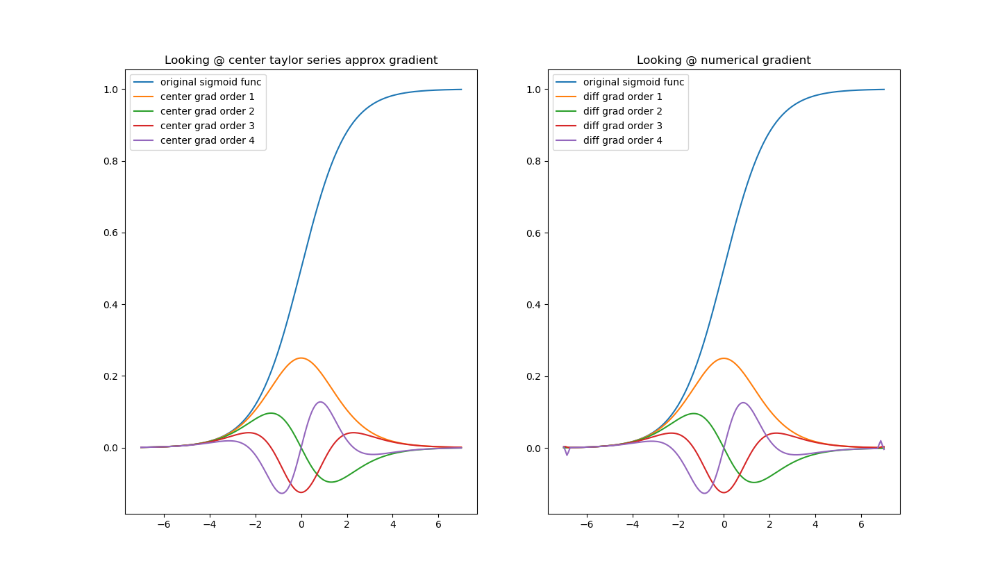

# Numerical Optimization


Includes Basic Understanding of Combinatorics, Game Theory, and Differentations 

Still growing!!

## Differentation 

***FOR 1D ARRAYS***

See [diff notes](https://github.com/eddymina/numerical_optimization/blob/master/diff_notes.pdf) for my through mathematical explanation on gradient approximations

#### `center_grad(f,x,order,h=1e-2,precision=2)`:

Computes the numerical gradient up the 4th derivative using center gradient taylor series approximation 

`f` must be a numpy based function as well as x a numpy array. 

#### `diff_grad(y,x,order=1,boundaries=False)`:

Rough measurement of the Rate of Change

Boundaries includes creating a approximation of boundaries. This performs worse with higher order derivatives. Boundaries are approximated using one sided grads


```python
def func(x):     
	'''
	Float numpy based sigmoid
	function (Binary classification)
	'''            
	return  1. / (1. + np.exp(-x))

x = np.linspace(-7, 7, 200) #Create some sample points 


#compute first order derivative 

cg= center_grad(func,x,1) #center gradient (taylor series approx)
dg= diff_grad(func(x),x,order=1,boundaries=True) # (numerical gradient )
dg_no_boundaries= diff_grad(func(x),x,order=1,boundaries=False) # (numerical gradient w/o boundary approx )


print(dg.shape, dg_no_boundaries.shape)
((200,),((198,))
```

<p align="center"> 

</p>


### Matching

- Gale shapely algo, hungarian matrix, and factorial,permuations, and combintions

Hungarian Matrix Still in Progress

##### Simple Factorials and Combinatorics 

```python

>>factorial(4) 
24
>>4*3*2*1
24

>>permutation(n=10,r=2) #order matter AB != BA
90

>>combination(n=10,r=2) #order does matter AB = BA (less outcomes)
45
```
##### Gale Shapely Matching Algo Used in dating pools and pair based problems

```python
# Gale Shapley Matching Alg

>> guyprefers = {
	'abe':  ['abi', 'eve', 'cath', 'ivy', 'jan', 'dee', 'fay', 'bea', 'hope', 'gay'],
	'bob':  ['cath', 'hope', 'abi', 'dee', 'eve', 'fay', 'bea', 'jan', 'ivy', 'gay'],
	'col':  ['hope', 'eve', 'abi', 'dee', 'bea', 'fay', 'ivy', 'gay', 'cath', 'jan'],
	'dan':  ['ivy', 'fay', 'dee', 'gay', 'hope', 'eve', 'jan', 'bea', 'cath', 'abi'],
	'ed':   ['jan', 'dee', 'bea', 'cath', 'fay', 'eve', 'abi', 'ivy', 'hope', 'gay'],
	'fred': ['bea', 'abi', 'dee', 'gay', 'eve', 'ivy', 'cath', 'jan', 'hope', 'fay'],
	'gav':  ['gay', 'eve', 'ivy', 'bea', 'cath', 'abi', 'dee', 'hope', 'jan', 'fay'],
	'hal':  ['abi', 'eve', 'hope', 'fay', 'ivy', 'cath', 'jan', 'bea', 'gay', 'dee'],
	'ian':  ['hope', 'cath', 'dee', 'gay', 'bea', 'abi', 'fay', 'ivy', 'jan', 'eve'],
	'jon':  ['abi', 'fay', 'jan', 'gay', 'eve', 'bea', 'dee', 'cath', 'ivy', 'hope']}
>> galprefers = {
	'abi':  ['bob', 'fred', 'jon', 'gav', 'ian', 'abe', 'dan', 'ed', 'col', 'hal'],
	'bea':  ['bob', 'abe', 'col', 'fred', 'gav', 'dan', 'ian', 'ed', 'jon', 'hal'],
	'cath': ['fred', 'bob', 'ed', 'gav', 'hal', 'col', 'ian', 'abe', 'dan', 'jon'],
	'dee':  ['fred', 'jon', 'col', 'abe', 'ian', 'hal', 'gav', 'dan', 'bob', 'ed'],
	'eve':  ['jon', 'hal', 'fred', 'dan', 'abe', 'gav', 'col', 'ed', 'ian', 'bob'],
	'fay':  ['bob', 'abe', 'ed', 'ian', 'jon', 'dan', 'fred', 'gav', 'col', 'hal'],
	'gay':  ['jon', 'gav', 'hal', 'fred', 'bob', 'abe', 'col', 'ed', 'dan', 'ian'],
	'hope': ['gav', 'jon', 'bob', 'abe', 'ian', 'dan', 'hal', 'ed', 'col', 'fred'],
	'ivy':  ['ian', 'col', 'hal', 'gav', 'fred', 'bob', 'abe', 'ed', 'jon', 'dan'],
	'jan':  ['ed', 'hal', 'gav', 'abe', 'bob', 'jon', 'col', 'ian', 'fred', 'dan']}


>> gale_shapley(guyprefers,galprefers).match(verbose= False)
{'abi': 'jon', 'cath': 'bob', 'hope': 'ian', 'ivy': 'abe', 'jan': 'ed', 'bea': 'fred', 'gay': 'gav', 'eve': 'hal', 'dee': 'col', 'fay': 'dan'}


